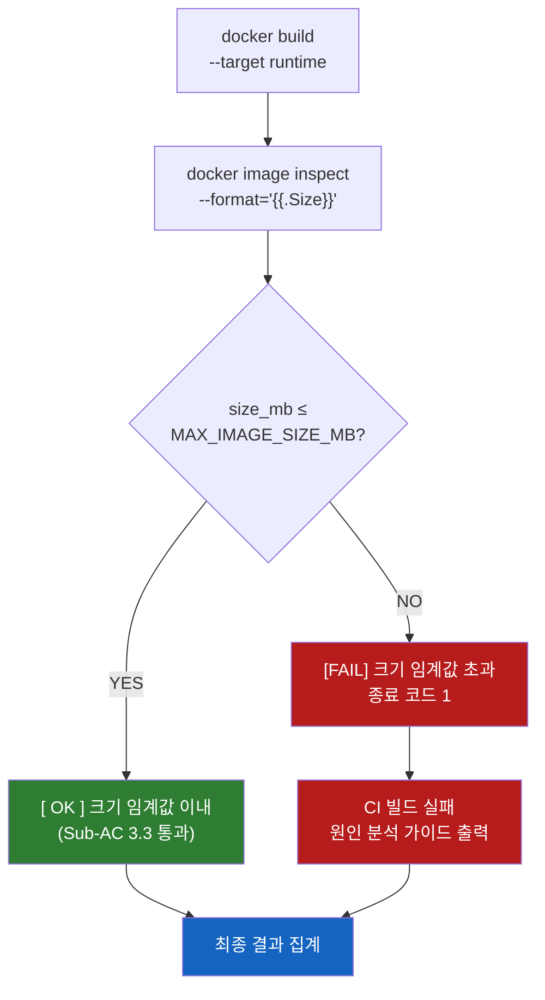

# Docker 이미지 크기 정책 (Sub-AC 3.3)

> **참조 구현**: `scripts/validate_prod_image.sh` — 검사 E 섹션  
> **CI 게이트**: `.github/workflows/e2e-smoke.yml` — `prod-image-validation` Job

---

## 요약

Cookiecutter 템플릿이 생성하는 FastAPI 백엔드의 프로덕션 Docker 이미지(`--target runtime`)는
아래 임계값 이하여야 합니다. 임계값 초과 시 `scripts/validate_prod_image.sh`는
종료 코드 1을 반환하고 CI 빌드가 실패합니다.

| 시나리오 | 권장 임계값 | 비고 |
|----------|------------|------|
| **auth 전용** (`include_chat_domain=no`) | **350 MB** | LangChain/litellm 미포함 |
| **auth + chat** (`include_chat_domain=yes`) | **600 MB** | LangChain + litellm 포함 |
| CI 기본값 (all-features 빌드) | **600 MB** | `e2e-smoke.yml` `MAX_IMAGE_SIZE_MB` 기본값 |
| 스크립트 기본값 (`--max-size-mb` 미지정) | **500 MB** | 단일 임계값으로 두 시나리오를 대략 커버 |

---

## 근거

### 기반 이미지 크기
`python:3.12-slim-bookworm` 압축 해제 크기 약 130–150 MB

### auth 전용 패키지 (≈ +100–130 MB)
- FastAPI, Uvicorn, SQLAlchemy (async), Alembic, asyncpg
- passlib + argon2-cffi, python-jose (cryptography)
- redis-py (hiredis), httpx
- structlog, fastapi-mail, sse-starlette
- pydantic, pydantic-settings

### chat 도메인 추가 패키지 (≈ +200–300 MB)
- langchain (≥ 0.3) — 대형 패키지 생태계
- langchain-litellm — litellm 어댑터 + 의존성
- sse-starlette (이미 auth에 포함)

> **참고**: 위 수치는 `docker image inspect` 기준 압축 해제 크기입니다.
> Docker Hub 또는 레지스트리에서 표시하는 압축 크기는 약 40–60% 더 작습니다.

---

## 임계값 설정 방법

### 1. CLI 옵션 (로컬 개발)

```bash
# auth 전용 프로젝트
bash scripts/validate_prod_image.sh --max-size-mb 350

# auth + chat 프로젝트
bash scripts/validate_prod_image.sh --max-size-mb 600

# 커스텀 임계값
bash scripts/validate_prod_image.sh --max-size-mb 400
```

### 2. 환경변수 (CI 권장)

```bash
# CI 파이프라인에서 환경변수로 설정
MAX_IMAGE_SIZE_MB=600 bash scripts/validate_prod_image.sh
```

```yaml
# .github/workflows/e2e-smoke.yml
prod-image-validation:
  env:
    MAX_IMAGE_SIZE_MB: "600"   # auth+chat 기본 시나리오
```

### 3. 시나리오별 CI 분리 (권장)

별도 시나리오를 검증하려면 matrix strategy를 활용합니다:

```yaml
strategy:
  matrix:
    include:
      - scenario: auth-only
        max_size_mb: 350
        extra_context: "include_chat_domain=no"
      - scenario: auth-chat
        max_size_mb: 600
        extra_context: "include_chat_domain=yes"
```

---

## 크기 초과 시 디버깅

### 레이어별 크기 분석 (dive)

```bash
# dive 설치 없이 Docker 이미지로 실행
docker run --rm -it \
  -v /var/run/docker.sock:/var/run/docker.sock \
  wagoodman/dive:latest <이미지-태그>
```

### Docker 히스토리

```bash
# 레이어별 크기 확인
docker history --no-trunc --format "{{.Size}}\t{{.CreatedBy}}" <이미지-태그> \
  | sort -rh | head -20
```

### 설치된 패키지 목록 (크기 순)

```bash
# 이미지 내 Python 패키지 + 크기 (압축 해제)
docker run --rm <이미지-태그> \
  /runtime-venv/bin/python -c "
import importlib.metadata, os, pathlib
dists = sorted(
    importlib.metadata.distributions(),
    key=lambda d: (d.metadata.get('Name') or '').lower(),
)
for d in dists:
    name = d.metadata.get('Name') or 'unknown'
    ver  = d.metadata.get('Version') or '?'
    print(f'{name:<40} {ver}')
"
```

---

## 크기 감소 전략

### 1. `.dockerignore` 보완

생성된 프로젝트의 `.dockerignore`에 아래 항목이 포함되어 있는지 확인:

```dockerignore
.git
.venv
.mypy_cache
.pytest_cache
__pycache__
*.pyc
*.egg-info
htmlcov
.coverage
tests/
docs/
*.md
```

### 2. 무거운 의존성 교체 검토

| 패키지 | 대안 | 절감 |
|--------|------|------|
| `langchain` (전체) | `langchain-core` + 필요한 통합만 | ~50–100 MB |
| `httpx` + `httpcore` | 이미 fastapi에 포함 — 중복 없음 | — |
| `cryptography` | 이미 python-jose 의존성 | — |

### 3. apt 패키지 최소화

런타임 이미지의 `apt-get install` 을 최소화합니다.  
현재 runtime 스테이지: `libpq5 curl` (총 두 패키지)

```dockerfile
# runtime 스테이지 — 최소 시스템 패키지만
RUN apt-get update && apt-get install -y --no-install-recommends \
        libpq5 \    # asyncpg 런타임 공유 라이브러리
        curl \      # HEALTHCHECK 전용
    && rm -rf /var/lib/apt/lists/*
```

### 4. `.pyc` 바이트코드 사전 컴파일

이미 빌더 스테이지에서 `UV_COMPILE_BYTECODE=1` + `compileall -q -j0` 로 수행 중.  
런타임 이미지가 `.py` 파일을 다시 컴파일하지 않으므로 기동 시간 단축과 동시에  
중복 파일 없이 크기를 유지합니다.

---

## CI 게이트 동작 흐름

크기 검증은 `validate_prod_image.sh`의 **검사 E**로 구현됩니다.



---

## 관련 파일

| 파일 | 역할 |
|------|------|
| `scripts/validate_prod_image.sh` | 이미지 크기 강제 검증 구현 (검사 E) |
| `.github/workflows/e2e-smoke.yml` | CI에서 `MAX_IMAGE_SIZE_MB` 설정 및 실행 |
| `{{cookiecutter.project_slug}}/Dockerfile` | 멀티스테이지 빌드 정의 |
| `{{cookiecutter.project_slug}}/.dockerignore` | 컨텍스트 최소화 |
